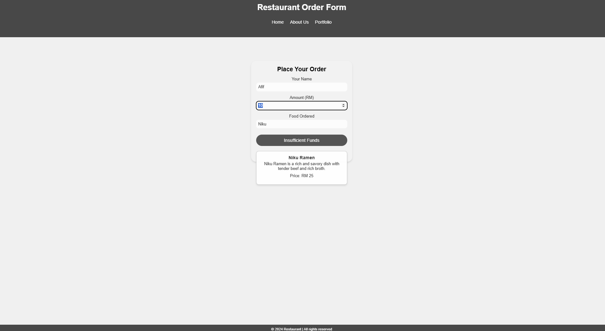

# Restaurant Order Form 🍜

A sleek and dynamic restaurant order form featuring real-time food details and validation.



## Features ✨

* **Real-time Food Information Display** - Dynamic updates of food details and pricing as users make selections
* **Smart Input Validation** - Comprehensive validation for food selection and available funds to ensure accurate ordering
* **Responsive Design** - Fully optimized layout that adapts seamlessly across desktop, tablet, and mobile devices
* **User-friendly Interface** - Intuitive design focusing on ease of use and clear visual feedback
* **Robust Error Handling** - Comprehensive error management with clear user feedback messages
* **Modern UI Design** - Clean, contemporary aesthetic following current design trends

## Technologies Used 🛠️

* HTML5
* CSS3
* JavaScript (ES6+)
* PHP for backend form processing
* MySQL for database storage

## Project Structure 📁

```
restaurant-order-form/
├── index.html
├── order-form.html
├── insert-data.php
├── connection.php
├── assets/
│   ├── css/
│   │   └── order-form.css
│   ├── img/
│   │   └── preview.png
└── README.md
```

## Getting Started 🚀

1. Clone the repository:
   ```bash
   git clone https://github.com/your-username/restaurant-order-form.git
   ```

2. Navigate to the project directory:
   ```bash
   cd restaurant-order-form
   ```

3. Start a local server (for PHP):
   ```bash
   php -S localhost:8000
   ```

4. Access the application:
   ```
   http://localhost:8000/order-form.html
   ```

## Usage 💡

### Form Features

#### Dynamic Food Details
* Enter food name (e.g., "niku", "shoyu") to view details and price
* Displays availability status for each menu item

#### Validation Rules
* Order placement requires sufficient funds (input amount ≥ food price)
* Form submission is disabled for invalid inputs or insufficient funds

### Supported Menu Items

* Niku Ramen: RM 25
* Shoyu Ramen: RM 20
* Miso Ramen: RM 22
* Shio Ramen: RM 18
* Vegetarian Ramen: RM 20

### Backend Order Processing
* Orders are stored in MySQL database via insert-data.php
* Includes comprehensive error handling for all submission scenarios

## Customization 🎨

### Styling

Modify the CSS variables in `order-form.css`:
```css
:root {
    --primary-color: #ff6347;
    --secondary-color: #4caf50;
    /* Add or modify custom variables */
}
```

### Menu Items 

Update the food menu in `order-form.html`:
```javascript
var availableRamen = {
    "niku": {
        name: "Niku Ramen", 
        price: 25, 
        description: "Savory ramen with tender beef."
    },
    /* Add new items or update existing ones */
};
```

### Database Configuration

Configure database credentials in `connection.php`:
```php
$servername = "localhost";
$username = "root";
$password = "your_password";
$dbname = "db-ramen";
```

## Responsive Design 📱

* Desktop optimized (>1024px)
* Tablet friendly (768px - 1024px)
* Mobile responsive (<768px)

## Contributing 🤝

1. Fork the repository
2. Create your feature branch (`git checkout -b feature/AmazingFeature`)
3. Commit your changes (`git commit -m 'Add some AmazingFeature'`)
4. Push to the branch (`git push origin feature/AmazingFeature`)
5. Open a Pull Request

## License 📝

This project is open-source.

## Support 🙋‍♂️

For support, please open an issue in the repository.

## Acknowledgments 🙏

* Design inspiration from modern UI/UX trends
* JavaScript implementation for dynamic interactions